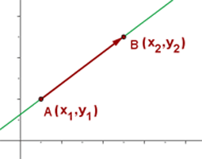

# Qua.Math

Permite

### Alcance ###

* Ecuación de la Recta
* Intersección de Rectas
* Punto Medio
* Distancia entre dos puntos
* Distancia de un punto a una recta
* Pendiente de inclinacion de una recta
* Angulo en notación sexagecimal y radian
* Angulo entre dos rectas
* Complemento y Sumplemento de un angulo

### Ecuacion General 

### Implementacion

    // Puntos Iniciales y Finales de la Recta
    generarEcuacion(
        {x: -57.5516653060913, y: -25.336896667846172 },
        {x: -57.552150785923, y:-25.338130579204833}
    );
